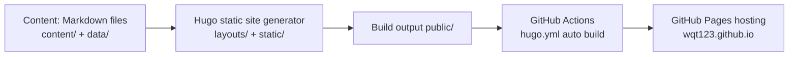

# Building a Personal Blog with Hugo: From Design to Auto-Deploy

## 1. Why build this blog

For a personal blog, what I wanted was not "a website where I can publish posts", but:

- **Free**: no server bills, no domain renewals; long-term maintenance cost is zero
- **Controllable**: content is plain Markdown files in my own repository, migratable at any time
- **Long-term accumulation**: distill scattered inputs into reusable understanding, instead of publishing and forgetting
- **Designed**: not a ready-made theme template, but something I can iterate into the exact shape I want

Among static site generators, I compared Jekyll, Hexo and Hugo, and the reasons for choosing Hugo were concrete:

- **Single binary**: the whole tool is one executable; on macOS you just drop it into `~/bin`, no Ruby / Node runtime required
- **Fast builds**: a site with dozens of posts builds in tens of milliseconds; local preview refreshes instantly
- **Powerful templates**: `baseof` inheritance, `partials` reuse, and native taxonomy support are enough to express custom designs without modifying theme source code
- **Data-driven**: with the `data/` directory plus template iteration, metadata like "category definitions" can be a single source of truth

## 2. Site architecture

### Overall architecture



- **Hugo**: turns Markdown into HTML. Fast, single binary, flexible template system
- **GitHub Pages**: free static hosting, bound to the free `wqt123.github.io` domain
- **GitHub Actions**: auto-builds and publishes after every push to `main` — no manual uploads at all
- **AI agent (Doubao Work)**: collaborates directly in the local repository — reading the project, writing templates, iterating design, running commands, committing and pushing

### Directory structure

A Hugo site has only a few core directories:

```text
wqt123.github.io/
├── hugo.toml            # global configuration
├── content/             # content (Markdown)
│   ├── _index.md        # homepage content
│   ├── posts/           # posts section
│   │   ├── _index.md    # posts list page content
│   │   └── 2026-xx-xx-xxx.md
│   └── categories/      # category taxonomy term content
│       ├── notes/_index.md
│       ├── projects/_index.md
│       ├── topics/_index.md
│       └── thoughts/_index.md
├── layouts/             # templates
│   ├── _default/
│   │   ├── baseof.html  # site-wide skeleton
│   │   ├── index.html   # homepage
│   │   ├── list.html    # list pages
│   │   └── single.html  # post pages
│   ├── partials/        # reusable fragments
│   └── taxonomy/        # category page templates
├── data/                # non-content data (category definitions)
├── static/              # static assets published as-is (CSS/JS)
├── archetypes/          # templates for new posts
└── .github/workflows/   # CI deployment
```

The key insight: **`content/` holds content, `layouts/` holds structure, `data/` holds metadata, `static/` holds assets.** These four are decoupled — that is why the Hugo template system is pleasant to work with.

## 3. Content and configuration

### Configuration: hugo.toml

Core configuration of this blog (excerpt):

```toml
baseURL = "https://wqt123.github.io/"
languageCode = "zh-cn"
title = "WQT Agent Lab"
hasCJKLanguage = true
enableRobotsTXT = true

[params]
description = "一个 Agent 工程师持续学习、构建和思考的个人工作台。"
subtitle = "和智能体一起，持续构建。"

[taxonomies]
tag = "tags"
series = "series"
category = "categories"

[permalinks]
posts = "/posts/:slug/"
```

A few points worth noting:

- `hasCJKLanguage = true`: lets Hugo truncate summaries using CJK language rules; otherwise Chinese summary cut-off points look odd
- `taxonomies`: built-in tag/series plus a new category — three classification systems each doing its own job
- `permalinks`: post URLs use `:slug`, hiding dates for stable long-term references
- `summaryLength`: controls how much body text is truncated on list pages

### Content organization: sections and taxonomies

The fastest way for a personal blog to lose control is "content without structure". I use a two-layer model:

**Primary category (taxonomy, exactly one)** — expresses "what kind of content this is":

| Category | Positioning |
| --- | --- |
| notes | Concept breakdowns, paper reading, tool exploration |
| projects | Real implementations, lessons learned, engineering retrospectives |
| topics | Systematically organized knowledge for long-term reuse |
| thoughts | Industry observations, personal judgments, unfinished ideas |

**Tags (multiple optional)** — express "what technology this content involves".

Category definitions live in `data/categories.toml` as the single source of truth:

```toml
[[categories]]
slug = "projects"
title = "项目实践"
code = "BUILD"
description = "真实实现、踩坑记录、工程复盘。"
empty = "正在构建"
```

Each post declares its category in front matter:

```yaml
---
title: "用 Hugo 搭建个人博客"
date: 2026-09-27T11:00:00+08:00
categories:
  - projects
tags: ["hugo", "github-pages"]
---
```

**Turning content conventions into engineering constraints**: a partial specifically validates category legality — a post without a category, or with a category not in the definition table, fails the build. Enforce it at build time instead of relying on discipline.

## 4. Templates and design

Chapter 3 was about what the site *has*: configuration, content organization and category data. This chapter is about how that content **looks on the page, and why it looks that way** — which is also why the two chapters are separate: **Chapter 3 is the content layer, Chapter 4 the presentation layer**. Changing content does not touch the looks, and changing the looks does not touch content; the two evolve independently.

The five sections form one thread: first a mental model of rendering (how templates decide each page), then the design decision behind each of the three key templates (site-wide skeleton, homepage, post page), and finally where the visual design came from.

### First, how a page gets rendered

Hugo separates "content" from "looks" completely: Markdown files in `content/` only carry content, and templates in `layouts/` decide what each page looks like. Rendering matches a template by **page type**:

```
Post        content/posts/xxx.md ──→ layouts/_default/single.html
Homepage                       ──→ layouts/index.html
Category list                  ──→ layouts/_default/list.html
```

All of them share one baseof skeleton, so navigation and footer are common. The takeaway: **to change the looks, edit templates; to add content, write Markdown — the two never interfere**. That is the starting point for every design decision that follows.

### baseof: the parts written once for the whole site

baseof is the site-wide skeleton: `<html>`, head meta, navigation and footer all live here, and every page inherits it. The core is a single line, `{{ block "main" . }}` — a **slot** that each specific page (homepage, post) fills in:

```go-html-template
<body>
  <header class="site-header">…nav…</header>
  <main id="main-content" class="site-main">
    {{ block "main" . }}{{ end }}   <!-- page content goes here -->
  </main>
  <footer class="site-footer">…footer…</footer>
</body>
```

Result: the parts shared by the whole site are written once; edit the navigation once and every page updates.

### Homepage: structure driven by data

The homepage does not show a hardcoded post stream. Instead it reads the category data in `data/categories.toml` and renders entry cards in a loop:

```go-html-template
{{ range $index, $category := .Site.Data.categories.categories }}
  <a class="category-path" href="{{ $.Site.GetPage (printf "/categories/%s" $category.slug) }}">
    <span>{{ printf "%02d" (add $index 1) }} / {{ $category.code }}</span>
    <h3>{{ $category.title }}</h3>
  </a>
{{ end }}
```

Result: the homepage structure is decided by data. To add a new category later, edit one line of data — the template does not move. This is "content decoupled from structure" in practice.

### The post page: assembling meta, TOC and body

The post page assembles in a fixed order: header (category, date, reading time) → sidebar TOC → body. The line most worth noticing is the **conditional TOC**:

```go-html-template
{{ if gt (len .TableOfContents) 40 }}
  <aside class="article-toc">{{ .TableOfContents }}</aside>
{{ end }}
<div class="article-content">{{ .Content }}</div>
```

`.TableOfContents` is the TOC HTML Hugo generates natively; the template only decides "show the sidebar when the TOC is long enough". So **long posts automatically get a TOC, short posts do not waste layout space** — the capability comes from Hugo, the design trade-off is yours.

### Iterating the visual design with AI

Templates answer "how it is implemented"; this section answers "why it looks like this". I did not install a theme — instead I handed the design requirements to Doubao Work (an AI agent). The key is **giving direction, not answers**: let it first understand the existing site, then produce several high-fidelity directions to compare in the browser, give feedback round after round, and finally translate the approved direction into templates and CSS.

The prompt that guides the AI looks roughly like this (you can copy and adapt it):

```text
Get familiar with this Hugo blog: read content/, layouts/ and static/css
to understand how it looks today.
Give me 3 different visual directions, each as high-fidelity HTML covering
the homepage, the post list, and the reading page, opened in the browser
for comparison. Requirements: the design must have a clear point of view,
not the default template look.
```

Then give feedback round by round, for example: "remove the 'current focus' block from the homepage", "keep only GitHub in the navigation", "switch the primary color to indigo with zero border radius". After each change, have the AI screenshot and self-check; only move to the next round when there is no layout overflow.

The final sign-off is "Signal White · Editorial Lab": true white background, indigo primary color, amber signal dots, zero border radius, editorial-magazine typography, with **restraint** as the principle — the homepage has only a main tagline and four category entries. The value of AI is not "generating a website" but turning "the website I imagine" into "the website that actually runs", step by step.

## 5. Build and deploy

### Local build and preview

Installation (a version identical to CI):

```bash
mkdir -p ~/bin
curl -L -o /tmp/hugo.tar.gz \
  https://github.com/gohugoio/hugo/releases/download/v0.145.0/hugo_extended_0.145.0_darwin-universal.tar.gz
tar -xzf /tmp/hugo.tar.gz -C /tmp
mv /tmp/hugo ~/bin/hugo
hugo version   # v0.145.0+extended
```

Preview and build:

```bash
hugo server          # local live preview, default http://localhost:1313
HUGO_ENVIRONMENT=production hugo --minify   # production build, output to public/
```

**Version alignment principle**: your local version must exactly match `hugo-version` in the CI workflow, otherwise template syntax differences will explode online. The `extended` build is mandatory, or SCSS/SASS-related template compilation fails.

### Auto-deploy: GitHub Pages + Actions

The core of deployment is `.github/workflows/hugo.yml`:

```yaml
on:
  push:
    branches: [main]

permissions:
  contents: read
  pages: write
  id-token: write

concurrency:
  group: pages
  cancel-in-progress: true

jobs:
  build:
    runs-on: ubuntu-latest
    steps:
      - uses: actions/checkout@v4
      - uses: actions/configure-pages@v5
      - uses: peaceiris/actions-hugo@v3
        with:
          hugo-version: "0.145.0"
          extended: true
      - run: hugo --minify
      - uses: actions/upload-pages-artifact@v3
        with:
          path: ./public

  deploy:
    needs: build
    runs-on: ubuntu-latest
    steps:
      - uses: actions/deploy-pages@v4
```

The **one-time setup** that goes with it (GitHub repo Settings → Pages):

1. Build and deployment → set Source to **GitHub Actions** (not "Deploy from a branch"!)
2. From then on, every `git push main` automatically runs build → upload artifact → publish

## 6. Analytics and comments

After the blog went live, I added the two things every content site is expected to have: pageview analytics and reader comments. Both follow the same maintenance philosophy as the rest of the site — **free, data under your control, no self-hosted backend**.

### Pageviews: GoatCounter

During evaluation I compared Umami, Plausible and Busuanzi, and ended up with GoatCounter:

- **Free tier of 100k pageviews/month**, enough for a personal blog
- **Privacy-friendly**: no cookies, no per-person tracking
- Data is exportable, and it supports self-hosting (again a single binary)

Integration happens in three layers: **reporting** (a `count.js` script on the page sends visits to GoatCounter), **dashboard** (PV/UV, referrers, top pages), and **display** (the view count in the post meta area).

Two settings must be turned on manually in the GoatCounter dashboard, or the counter endpoint returns 403:

- **Dashboard viewable by → Anyone** (public stats): the visitor counter only works for public sites
- **Allow adding visitor counts on your website**: off by default

For display I did not use the official badge iframe (it ships with a border and a "by GoatCounter" label that clashes with the restrained Signal White design). Instead I query the official **JSON endpoint** and render the number as plain text:

```js
fetch('https://MYCODE.goatcounter.com/counter/' + encodeURIComponent(path) + '.json')
  .then(r => r.json())
  .then(d => { el.textContent = d.count; })
```

`MYCODE` is the account name you chose at signup (of the form `your-account.goatcounter.com`); it is an account-level identifier, so the example uses a placeholder.

Two practical notes:

- **Counts are cached for up to 4 hours**: numbers for a new page or a first visit do not appear immediately — that is expected
- **Self-host the script**: the official CDN (`gc.zgo.at`) is unreachable from mainland China networks, so I downloaded `count.js` into `static/js/`; static JS gets a Hugo fingerprint hash so browsers never serve a stale cached version

### Comments: Giscus

I compared utterances, Twikoo and Waline, and chose **Giscus**: comment data lives directly in **your repository's GitHub Discussions** — no database, no backend, free forever. Visitors comment with their GitHub account, and you manage every comment on GitHub itself.

Setup steps:

1. Enable **Discussions** in repo Settings → Features, choosing the **Announcements** category (only maintainers can open threads, so comments cannot be spammed)
2. Install the **giscus GitHub App** (grant access to the blog repository only — least privilege)
3. On the giscus.app config page, after picking the repository and category, the page generates `data-repo-id` and `data-category-id` for you — these are account-level identifiers and are not published in public content. The config looks like this:

```toml
[params.giscus]
enabled = true
repo = "your-username/your-blog-repo"
repoId = "generated automatically on giscus.app"
category = "Announcements"
categoryId = "generated automatically on giscus.app"
```

4. Mount giscus's `client.js` on the post page with `data-mapping="pathname"` — each page path automatically matches its own discussion

I chose the `pathname` mapping: **every post automatically maps to one Discussion**, visitor comments land under that post's title, and there is nothing to create manually.
