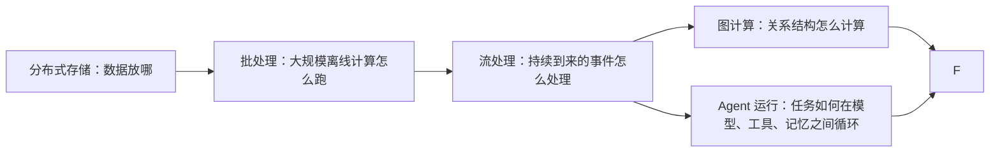

# 大数据、图计算与 Agent 原理学习指南

## 1. 这份文档是给什么人写的

这份文档是给下面这种场景准备的：

- 你现在因为工作，需要快速理解 Flink、图计算、agent、安全
- 但你真正想积累的，不是某个垂直方向的碎片知识
- 而是以后无论做安全、风控、推荐、数据平台、agent 平台，都能复用的底层理解

所以本文不会把重点放在“记某个框架 API”上，而会放在：

1. 这些系统为什么会出现
2. 它们各自解决什么问题
3. 它们的核心抽象是什么
4. 这些抽象之间怎么连起来
5. 安全只是这些原理的一个应用场景，而不是全部

## 2. 先给你一个总框架

如果把你接下来要学的内容浓缩成一张地图，可以这样看：

这张图里最重要的一点是：

> 你不是在学四个互不相干的主题，而是在学“数据、关系、状态、决策”这四件事如何在现代系统里被组织起来。

## 3. 你真正应该形成的核心能力

如果你以后不一定继续做安全，那你最值得投资的能力，不是“知道某条安全规则”，而是下面四种：

### 3.1 看到系统时，能先找它的抽象

例如：

- HDFS 的抽象是“面向大文件、容错、吞吐优先的分布式文件系统”
- MapReduce 的抽象是“把大规模批处理拆成 map / shuffle / reduce”
- Flink 的抽象是“对有界或无界数据流做有状态计算”
- Pregel 的抽象是“顶点中心的迭代式图计算”
- Agent 的抽象是“模型驱动的循环式工作流执行”

### 3.2 看到系统时，能先找它的约束

例如：

- 分布式系统里网络会抖、机器会挂、数据会迟到
- 图计算里 power-law 图很难均匀分片
- Agent 里模型并不稳定、工具返回也不一定可信

### 3.3 看到业务问题时，能先判断该用什么计算模型

例如：

- 每晚全量算一次，适合批处理
- 事件持续到来，适合流处理
- 问题本质上是“谁和谁有关系”，适合图计算
- 问题本质上是“模型在环境里持续决策”，适合理解 agent loop

### 3.4 看到一个新框架时，能把它归类到老问题上

例如：

- HDFS 是 GFS 思想的开源实现路径之一
- Flink 是现代流处理和 Dataflow 模型的一种代表实现
- Gelly / GraphX 是图计算框架在具体生态里的落地
- Agent SDK / OpenClaw / LangGraph 本质上都在处理“工作流控制 + 工具编排 + 状态管理”

## 4. 为什么学习顺序不能乱

很多人一上来就学：

- Flink API
- 图算法 API
- Agent 框架用法

这样很容易会用，但很难理解。

更��的顺序应该是：

1. `存储`
2. `批处理`
3. `流处理`
4. `图计算`
5. `Agent`
6. `业务应用`

原因很简单：

- 没有存储，就没有数据
- 没有批处理，就不理解“为什么需要并行计算框架”
- f��有流处理，就不理解“为什么 Flink 不是 Spark 的另一个名字”
- f��有图计算，就不理解“关系数据为什么不能只当表来算”
- 没有 agent 原理，就不理解“模型为什么不只是生成文本”

## 5. 第一部分：大数据原理

## 5.1 为什么会有“大数据系统”

“大数据”这个词经常被说得很虚，但你可以先把它理解成一个非常朴素的问题：

> 当数据量大到一台机器放下，算不完、扛不住时，怎么办？

于是就会出现三个核心问题：

1. 数据怎么分布式存
2. 计算怎么并行跑
3. 机器坏了怎么保证结果还能出来

大数据系统，本质上就是围绕这三个问题搭出来的。

## 5.2 GFS / HDFS：先解决“数据放哪”

Google File System
