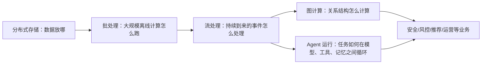
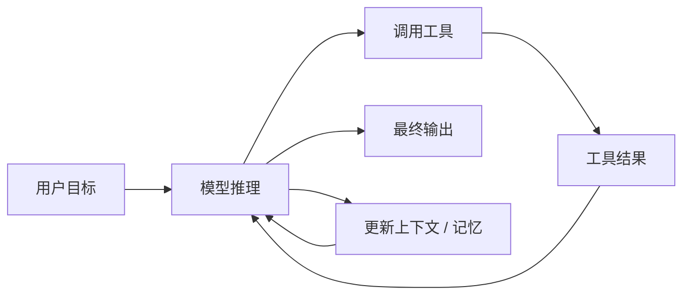

---
title: "大数据、图计算与 Agent 原理学习指南"
date: 2026-04-11T20:40:00+08:00
draft: false
slug: "bigdata-graph-agent-learning-guide"
summary: "一份从分布式存储、批处理、流处理、图计算到 Agent 原理的中文学习路线，目标是在短时间内建立可复用的底层理解。"
category: "topics"
tags:
  - bigdata
  - graph
  - flink
  - agent
  - learning-path
series:
  - 学习材料
---

# 大数据、图计算与 Agent 原理学习指南

## 1. 这份文档是给什么人写的

这份文档是给下面这种场景准备的：

- 你现在因为工作，需要快速理解 Flink、图计算、agent、安全
- 但你真正想积累的，不是某个垂直方向的碎片知识
- 而是以后无论做安全、风控、推荐、数据平台、agent 平台，都能复用的底层理解

所以本文不会把重点放在“记某个框架 API”上，而会放在：

1. 这些系统为什么会出现
2. 它们各自解决什么问题
3. 它们的核心抽象是什么
4. 这些抽象之间怎么连起来
5. 安全只是这些原理的一个应用场景，而不是全部

## 2. 先给你一个总框架

如果把你接下来要学的内容浓缩成一张地图，可以这样看：



这张图里最重要的一点是：

> 你不是在学四个互不相干的主题，而是在学“数据、关系、状态、决策”这四件事如何在现代系统里被组织起来。

## 3. 你真正应该形成的核心能力

如果你以后不一定继续做安全，那你最值得投资的能力，不是“知道某条安全规则”，而是下面四种：

### 3.1 看到系统时，能先找它的抽象

例如：

- HDFS 的抽象是“面向大文件、容错、吞吐优先的分布式文件系统”
- MapReduce 的抽象是“把大规模批处理拆成 map / shuffle / reduce”
- Flink 的抽象是“对有界或无界数据流做有状态计算”
- Pregel 的抽象是“顶点中心的迭代式图计算”
- Agent 的抽象是“模型驱动的循环式工作流执行”

### 3.2 看到系统时，能先找它的约束

例如：

- 分布式系统里网络会抖、机器会挂、数据会迟到
- 图计算里 power-law 图很难均匀分片
- Agent 里模型并不稳定、工具返回也不一定可信

### 3.3 看到业务问题时，能先判断该用什么计算模型

例如：

- 每晚全量算一次，适合批处理
- 事件持续到来，适合流处理
- 问题本质上是“谁和谁有关系”，适合图计算
- 问题本质上是“模型在环境里持续决策”，适合理解 agent loop

### 3.4 看到一个新框架时，能把它归类到老问题上

例如：

- HDFS 是 GFS 思想的开源实现路径之一
- Flink 是现代流处理和 Dataflow 模型的一种代表实现
- Gelly / GraphX 是图计算框架在具体生态里的落地
- Agent SDK / OpenClaw / LangGraph 本质上都在处理“工作流控制 + 工具编排 + 状态管理”

## 4. 为什么学习顺序不能乱

很多人一上来就学：

- Flink API
- 图算法 API
- Agent 框架用法

这样很容易会用，但很难理解。

更好的顺序应该是：

1. `存储`
2. `批处理`
3. `流处理`
4. `图计算`
5. `Agent`
6. `业务应用`

原因很简单：

- 没有存储，就没有数据
- 没有批处理，就不理解“为什么需要并行计算框架”
- 没有流处理，就不理解“为什么 Flink 不是 Spark 的另一个名字”
- 没有图计算，就不理解“关系数据为什么不能只当表来算”
- 没有 agent 原理，就不理解“模型为什么不只是生成文本”

## 5. 第一部分：大数据原理

## 5.1 为什么会有“大数据系统”

“大数据”这个词经常被说得很虚，但你可以先把它理解成一个非常朴素的问题：

> 当数据量大到一台机器放不下、算不完、扛不住时，怎么办？

于是就会出现三个核心问题：

1. 数据怎么分布式存
2. 计算怎么并行跑
3. 机器坏了怎么保证结果还能出来

大数据系统，本质上就是围绕这三个问题搭出来的。

## 5.2 GFS / HDFS：先解决“数据放哪”

Google File System（GFS）是非常重要的起点。它强调的是：

- 运行在廉价机器上
- 机器坏是常态，不是例外
- 面向超大文件
- 偏向高吞吐，而不是传统文件系统那种低延迟随机读写 [^1]

HDFS 是受 GFS 思想影响非常深的开源体系。HDFS 官方架构文档也明确强调：

- 面向 commodity hardware
- 高容错
- 高吞吐
- streaming data access
- “moving computation is cheaper than moving data” [^2]

你要抓住的不是实现细节，而是这句话：

> 在大数据时代，计算应尽量靠近数据，而不是让数据满网络乱跑。 

这句话后面会一路影响到 MapReduce、Spark、Flink，甚至影响你对 agent telemetry 处理方式的理解。

## 5.3 MapReduce：再解决“怎么批量算”

MapReduce 解决的是：

> 当数据太大，没法单机算时，怎么把问题拆给很多机器一起做？

它的核心抽象很简单：

- `Map`：并行处理局部数据，产出中间 key-value
- `Shuffle`：按 key 聚合
- `Reduce`：把同一个 key 的结果合并 [^3]

这套模型为什么重要？

不是因为你未来一定手写 MapReduce，而是因为它奠定了一个思维方式：

> 大规模计算的关键，不是把代码“放大”，而是把问题拆成可并行、可重试、可聚合的形状。

MapReduce 的局限也很重要：

- 它非常适合批处理
- 但不适合持续到来的数据
- 对迭代式计算不够友好
- 对低延迟场景不够友好

而这些局限，正是后面流处理和图计算系统出现的原因。

### 5.3.1 一个最经典的例子：词频统计

如果你第一次接触 MapReduce，最容易理解的例子就是：

> 统计一大批文档里，每个单词出现了多少次。

假设有三条文本：

- `cat dog`
- `cat fish`
- `dog cat`

#### 第一步：Map

Map 的作用不是“得出最终答案”，而是把原始数据先拆成适合聚合的中间结果。

处理后会变成：

- `cat dog` -> `(cat,1) (dog,1)`
- `cat fish` -> `(cat,1) (fish,1)`
- `dog cat` -> `(dog,1) (cat,1)`

这里的意思很简单：

- 看到一个 `cat`，就产出 `(cat,1)`
- 看到一个 `dog`，就产出 `(dog,1)`

所以 Map 阶段的核心是：

> 把原始数据“翻译”成统一的 key-value 中间格式。

#### 第二步：Shuffle

Shuffle 的作用是把**同一个 key** 的数据聚到一起。

经过 Shuffle 之后，会变成：

- `cat -> [1,1,1]`
- `dog -> [1,1]`
- `fish -> [1]`

也就是说：

- 不同机器上产生的 `cat`
- 最终都要被送到同一个地方
- 这样后面才能一起算

#### 第三步：Reduce

Reduce 的作用是把同一个 key 对应的一组值合并成最终结果。

所以最终得到：

- `cat -> 3`
- `dog -> 2`
- `fish -> 1`

因此你可以把 MapReduce 先记成一句很朴素的话：

- `Map`：先拆
- `Shuffle`：按同类归并
- `Reduce`：做最终汇总

### 5.3.2 为什么 Shuffle 往往最贵

很多初学者会以为最复杂的是 Map 或 Reduce，实际上很多时候最贵的是 Shuffle。

原因主要有三类：

#### 1. 它要跨机器搬数据

Map 往往先在本地处理自己拿到的数据。  
但 Shuffle 要做的是：

- 按 key 重新分组
- 把同一个 key 的中间结果发到同一个 reducer

这意味着大量网络传输。

#### 2. 它通常伴随排序和分组

系统为了把同 key 的值聚在一起，通常需要做：

- 分区
- 排序
- merge

所以不仅耗网络，也耗磁盘和 CPU。

#### 3. 它很容易遇到数据倾斜

如果某个 key 特别大，比如：

- 绝大多数 key 只出现几千次
- 但某个 key 出现几亿次

那负责这个 key 的 reducer 就会非常慢，甚至内存顶不住。

这就是典型的 `data skew` 或 `hot key` 问题。

### 5.3.3 “同一个 key 会不会大到一台机器放不下？”

会。

这个问题非常真实，也正好说明：

> MapReduce 的基本抽象很强大，但并不自动解决所有分布式问题。

比如某些场景下：

- 所有正常 key 数据量都不大
- 但某一个 key 特别热
- 结果这个 key 被路由到某一个 reducer
- 那台机器就会变成瓶颈

这就是为什么实际工程里，不能只知道 Map / Shuffle / Reduce 这三个词，还要理解倾斜治理。

### 5.3.4 系统怎么决定一个 key 该去哪台机器

这个问题本质上是在问：

> Shuffle 时，一台机器怎么知道自己该保留哪个 key？

答案通常不是“机器自己随便决定”，而是由系统统一的 `partitioner` 决定。

最常见的规则是：

```text
partition = hash(key) % reducer数量
```

比如有 3 个 reducer：

- `hash(cat) % 3 = 0`
- `hash(dog) % 3 = 2`
- `hash(fish) % 3 = 1`

那系统就知道：

- `cat` 发给 reducer 0
- `dog` 发给 reducer 2
- `fish` 发给 reducer 1

这里最重要的点是：

> 不是机器自己决定，而是所有机器都按同一条规则计算“这个 key 应该去哪”。

这样即使 map 任务分布在很多台机器上，大家仍然能一致地把同一个 key 发往同一个 reducer。

### 5.3.5 那为什么有统一分区规则，还是会热点？

因为统一规则只解决了：

- “同一个 key 去同一个地方”

但并没有解决：

- “某个 key 的数据量会不会大得离谱”

也就是说，`partitioner` 保证的是**一致性**，不是**负载均衡**。

一个极热的 key，不管 hash 多么标准，最后还是会集中到一个地方。

### 5.3.5.1 不同 key 会不会 hash 到同一个 reducer？

会，而且这是正常现象。

这里最容易混淆的是两件事：

1. `partition` 决定的是“发到哪个 reducer”
2. `key` 决定的是“在 reducer 内部怎么分组和合并”

也就是说，下面这个规则：

```text
partition = hash(key) % reducer数量
```

回答的不是：

- “这个 key 是不是唯一”

而是：

- “这个 key 应该去哪个 reducer”

例如有 3 个 reducer：

- `cat -> reducer 1`
- `dog -> reducer 1`
- `fish -> reducer 2`

这里 `cat` 和 `dog` 虽然不是同一个 key，但它们完全可能落到同一个 reducer。  
这不叫错误，这很正常。

真正重要的不是“不同 key 不冲突”，而是：

> 同一个 key 必须稳定地映射到同一个 reducer。

例如：

- 所有 `cat` 都必须去 reducer 1
- 不能一部分 `cat` 去 reducer 1，另一部分 `cat` 去 reducer 2

因为如果同一个 key 被拆到多个 reducer，后续就没法得到完整结果了。

所以你可以这样记：

- 一个 reducer 里可以有很多不同 key
- 但同一个 key 不能散落到多个 reducer

### 5.3.5.2 Reducer 里有很多 key，那系统怎么区分？

虽然 `cat` 和 `dog` 都可能被送到 reducer 1，但 reducer 收到的数据并不是“已经混成一团无法区分”，而是仍然带着 key：

- `(cat,1)`
- `(cat,1)`
- `(dog,1)`
- `(dog,1)`

Reducer 之后会继续按 key 把它们分开：

- `cat -> [1,1]`
- `dog -> [1,1]`

所以：

> 同一个 partition 只是一个桶，不是一个 key。

你可以把它理解成：

- `partition` 是“先送到哪个教室”
- `key` 是“到了教室以后再按小组坐好”

去同一个教室，不代表是同一个组。

### 5.3.5.3 为什么 reducer 内部通常还要排序

因为 reducer 不只是要“收到很多 key-value”，还要能高效地按 key 分组处理。

最常见的方式是：

1. 先按 partition 把数据送到对应 reducer
2. 在 reducer 端把数据按 key 排序或归并
3. 这样相同 key 的记录就会连续出现

例如 reducer 收到：

- `(cat,1)`
- `(dog,1)`
- `(cat,1)`
- `(fish,1)`
- `(dog,1)`

排序后就会变成：

- `(cat,1)`
- `(cat,1)`
- `(dog,1)`
- `(dog,1)`
- `(fish,1)`

这样 reducer 就能顺序扫描：

- 先处理完 `cat`
- 再处理完 `dog`
- 最后处理 `fish`

这就是为什么 Shuffle 往往不只是“发数据”，还经常伴随着：

- 分区
- 排序
- merge

所以它才会这么贵。

### 5.3.6 工程上怎么缓解 hot key

常见办法有几类。

#### 1. Combiner / 本地预聚合

如果 reduce 操作满足可结合、可交换，比如求和、计数，那么可以先在 map 本地做一轮合并。

例如原本输出：

- `(cat,1) (cat,1) (cat,1)`

本地先合并成：

- `(cat,3)`

这样网络上传输的数据会少很多。

#### 2. 两阶段聚合

如果某个 key 太热，可以先打散：

- `cat` 先拆成 `cat#1`、`cat#2`、`cat#3`

第一阶段先分别统计：

- `cat#1 -> 1000`
- `cat#2 -> 1200`
- `cat#3 -> 900`

第二阶段再把它们汇总回：

- `cat -> 3100`

这实际上是把一个过热 key 的计算，拆成多个子 key 再二次归并。

#### 3. 换更适合的计算模型

如果问题天然会产生极端热点，或者需要反复迭代，MapReduce 就不一定是最佳模型。

这也是为什么后面会有：

- 流处理
- 图计算
- 迭代式系统

### 5.3.7 安全场景下怎么理解这个例子

假设你们有大量 agent 执行日志，想统计：

> 每个 agent 调用了多少次 `exec`

那可以这样理解：

#### Map

每条日志如果是 `exec`，就变成：

- `(agent_id, 1)`

#### Shuffle

把相同 `agent_id` 的记录聚到一起。

#### Reduce

把这些 `1` 加起来，得到：

- `agent_a -> 183`
- `agent_b -> 27`

这个例子很重要，因为它会自然衔接到后面的 Flink：

> MapReduce 里的 Shuffle，本质上就是“按 key 重分发”；  
> Flink 里的 `keyBy`，本质上也是“按 key 把同类事件路由到同一个状态持有者”。

## 5.4 Bigtable：再解决“结构化数据如何大规模服务”

GFS/HDFS 解决了“文件怎么存”，MapReduce 解决了“批量怎么算”，但还有一个问题：

> 如果数据不是单纯文件，而是海量结构化记录，怎么存和查？

Bigtable 的意义就在这里。它是一个大规模结构化存储系统，强调：

- 海量数据
- 稀疏、结构化数据模型
- 动态控制数据布局
- 支持不同项目对吞吐和延迟的差异化需求 [^4]

你不一定马上要学到它的 tablet、SSTable 这些细节，但要理解：

> 大数据系统不只有“算”，还有“存储模型”和“访问模型”。

## 5.5 YARN：再解决“资源怎么分”

早期 Hadoop 里，MapReduce 自己既是计算框架，又顺手做资源管理。后来发现这样不灵活，于是有了 YARN。

YARN 的核心思想是把：

- 资源管理
- 应用调度与监控

拆开来处理。官方文档直接说，YARN 的基本思想就是把资源管理和作业调度/监控拆到不同守护进程中 [^5]。

这件事的重要性在于：

> 现代数据系统里，“如何算”与“怎么分资源”是两件事。

这也是你以后理解 Flink on YARN、Flink on K8s、甚至 agent runtime 调度时的重要背景。

## 6. 第二部分：为什么从批处理走向流处理

## 6.1 批处理为什么不够了

如果数据每天晚上统一到齐，那批处理很舒服：

- 全量跑一次
- 第二天看结果

但现实不是这样。很多场景里数据是持续到来的：

- 用户点击流
- 支付流水
- 设备日志
- 风控事件
- agent 执行事件

这时问题变成：

> 数据永远在来，你不能等“全到了”再算。

这就是流处理的出发点。

## 6.2 Dataflow 模型：现代流处理的心脏

Google 的 Dataflow 论文非常重要，因为它把现代流处理的几个核心矛盾讲透了：

- 数据是 `unbounded`
- 数据可能 `out-of-order`
- 你不可能同时把 correctness、latency、cost 都做到最优 [^6]

Dataflow 给出的关键思维转变是：

> 不要再假设数据最终会整整齐齐地“到齐”，而是要在数据永远不完整的前提下继续计算。

这是理解 Flink 的真正钥匙。

你只要先抓住四个概念：

1. `Event Time`
2. `Processing Time`
3. `Window`
4. `Trigger / Watermark`

简单说：

- Event Time：事件真实发生的时间
- Processing Time：系统实际处理它的时间
- Window：你按什么时间范围聚合
- Watermark：系统对“某个时间点之前的数据大体都到了”的估计

## 6.3 Flink：把 Dataflow 思想工程化

Flink 官方对自己的定义非常直接：

> Flink 是一个对有界和无界数据流做有状态计算的框架和分布式处理引擎 [^7]

这句话里的关键词只有两个：

- `data streams`
- `stateful`

很多初学者对 Flink 的误解是：“它就是一个快一点的计算框架。”

其实不是。

Flink 真正重要的是：

> 它让你能对持续到来的事件流，持续维护状态。

例如：

- 某个用户过去 10 分钟失败登录次数
- 某个 session 已经调用了几个 tool
- 某个 agent 最近访问过哪些资源
- 某个 IP 的异常图谱正在怎么变化

这类问题，本质上都不是“单条数据怎么处理”，而是“跨多条事件如何记住上下文”。

## 6.4 State：理解 Flink 的第一核心概念

Flink 官方文档说得很清楚：有些操作会跨多个事件记住信息，这些就是 stateful operations [^8]。

例如：

- 模式匹配要记住前面已经见过哪些事件
- 窗口聚合要记住目前累计到哪里了
- 风控系统要记住某个 key 最近的行为轨迹

所以：

> 学 Flink，第一件事不是学 API，而是接受“状态是第一公民”。

## 6.5 Checkpoint：理解 Flink 的第二核心概念

如果状态这么重要，那机器挂了怎么办？

这就是 checkpoint 的意义。

Flink 官方文档明确说：

> Checkpoint 用来让系统在故障后恢复状态和流位置，从而尽量保持和无故障执行相同的语义 [^9]

这件事为什么重要？

因为在现代事件系统里，你不只是要“把任务跑完”，你还要回答：

- 故障后会不会丢状态
- 会不会重复算
- 还能不能保证结果一致

## 6.6 你现在应该怎么理解 Flink

一句话版：

> Flink = 在分布式环境下，对事件流持续维护状态，并在故障时尽量保持一致性的系统。

你只要真正理解这句话，后面的 API、window、CEP、join、图流融合，都会更容易理解。

## 7. 第三部分：图计算原理

## 7.1 为什么图计算不是“表计算换个名字”

很多问题天然是“关系问题”，不是“记录问题”。

例如：

- 社交网络
- 风险传播
- 账户关联
- 攻击路径
- agent 与 tool / resource / session 的关系

如果你只是把这些数据当二维表去看，会很难自然地表达：

- 谁连接谁
- 哪些节点更中心
- 哪些路径更短
- 哪些子图异常

这就是图计算存在的原因。

## 7.2 图的基本抽象

图计算里最重要的是两个对象：

- `Vertex`
- `Edge`

如果再进一步，一般会走向 `Property Graph`：

- 顶点有属性
- 边也有属性

Spark GraphX 官方文档就用 `property graph` 这个抽象来描述图计算 [^10]。

你可以先记一句：

> 图不是把数据画成线，而是把“关系”提升为一等公民。

## 7.3 Pregel：图计算的经典抽象

Pregel 是图计算领域非常经典的系统。它提出的核心模型是：

- 顶点中心
- 迭代
- 消息传递
- 每轮 superstep 同步推进 [^11]

你可以把它理解成：

> 每个顶点都像一个小程序，它读上一轮别人发来的消息，更新自己的状态，再把消息发给别人。

Pregel 为什么重要？

因为它提供了一个非常清晰的心智模型，适合理解很多图算法：

- PageRank
- Connected Components
- Shortest Path

## 7.4 PowerGraph：为什么还要继续演化

Pregel 很好，但真实世界里的图经常是 power-law graph：

- 少数节点连接特别多
- 大多数节点连接很少

这会导致分片不均衡、热点严重、通信开销高。

PowerGraph 的贡献就在于：

- 重新思考图并行抽象
- 强调 natural graphs 的分布特性
- 用 vertex-cut 等方式缓解高阶节点带来的问题 [^12]

这告诉你一个很重要的原则：

> 图计算的难点，不只是算法本身，还包括图怎么分布式放、怎么切、怎么通信。

## 7.5 Gelly / GraphX：图计算在具体生态里的落地

Flink 的 Gelly 和 Spark 的 GraphX，都是把图计算嵌进已有分布式生态中的代表。

Gelly 官方文档强调：

- 图可以用 vertices + edges 表达
- 支持 iterative graph processing
- 支持 graph algorithms library [^13]

GraphX 官方文档强调：

- property graph
- graph operators
- optimized Pregel API [^10]

你要抓住的不是“哪家 API 更强”，而是：

> 图计算并不是孤立系统，它常常要和预处理、清洗、流式接入、结果回写放在同一条数据链路里。

## 8. 第四部分：Agent 原理

## 8.1 什么是 Agent

OpenAI 对 agent 的定义很实用：

> Agent 是能够代表用户独立完成任务的系统；它依赖模型来管理工作流执行和决策，并通过工具与外部系统交互 [^14]

Anthropic 则提醒得更朴素：

> 很多团队口中的“agent”，其实有的更接近 workflow，有的才是真正高自治 agent；最成功的实现通常是简单、可组合的模式，而不是复杂框架 [^15]

所以你可以把 agent 先分成两类：

- `Workflow-like agent`
- `Autonomous agent`

## 8.2 Agent 的最小闭环

一个 agent 最小可以抽象成这几个部分：

- `Model`
- `Instructions`
- `Tools`
- `Memory / Context`
- `Execution Loop`

可以画成这样：



这个图很重要，因为它告诉你：

> Agent 不是“一次生成”，而是“推理-行动-反馈-再推理”的循环系统。

## 8.3 ReAct：把推理和行动结合起来

ReAct 论文的贡献是把 reasoning 和 acting 放在同一条轨迹里，强调：

- 推理帮助更新计划
- 行动帮助从环境获取新信息
- 两者交替进行 [^16]

它之所以重要，不是因为你一定要照它写 prompt，而是因为它揭示了 agent 的本质：

> agent 的智能，很多时候不是单次推理强，而是能在和环境交互中不断修正。

## 8.4 Toolformer：为什么工具使用是 agent 的核心

Toolformer 论文说明了一件事：

> 模型不只是“能回答”，还可以学习“什么时候该调工具、调什么工具、怎么用返回值” [^17]

这意味着：

- 工具不是插件边角料
- 工具选择本身就是 agent 能力的一部分

## 8.5 多 Agent 为什么能看成图

OpenAI 的 agent 指南直接提到，多 agent 系统可以建模成图：

- agent 是节点
- tool call 或 handoff 是边 [^14]

这件事特别重要，因为它把你前面学的“图”和“agent”连起来了。

以后你看多 agent 系统时，可以直接问：

- 节点是什么
- 边是什么
- 状态放在哪
- 控制权怎么转移

## 8.6 Agent 和大数据 / 图计算的连接点

当 agent 进入生产后，会自然产生三类数据：

1. `事件流`
2. `状态`
3. `关系图`

具体对应：

- 一次 tool call 是事件流
- session risk / memory / plan 是状态
- user-agent-tool-resource 关系是图

所以：

> 大数据、图计算、agent 并不是三门平行课程，而是在现代系统里自然汇合。

## 9. 第五部分：这些原理怎么映射到安全业务

虽然你以后不一定继续做安全，但安全是一个非常好的练兵场，因为它同时需要：

- 实时事件处理
- 长期状态维护
- 关系分析
- 复杂执行控制

你可以把安全问题映射成这样：

| 原理 | 在安全中的映射 |
| --- | --- |
| HDFS / 分布式存储 | 海量日志与事件落盘 |
| MapReduce / 批处理 | 历史报表、离线画像、规则回溯 |
| Flink / 流处理 | 实时检测、实时状态更新、窗口统计 |
| 图计算 | 关联分析、传播分析、路径分析 |
| Agent 原理 | 理解 agent 如何计划、调用工具、执行、偏航 |

你未来就算不做安全，这套映射也仍然成立，只是换成：

- 推荐
- 反欺诈
- 营销
- 运维
- 智能客服

## 10. 五天学习计划：以“能讨论”和“能参与设计”为目标

你给出的目标是：

- 3 个工作日内，能参与讨论
- 5 个工作日内，能参与实现设计

这个目标是现实的，但前提是你不能“平均用力”，必须抓主线。

## 10.1 第 1 天：存储与批处理的历史主线

目标：

- 理解为什么大数据系统先从存储和批处理开始
- 理解 GFS / HDFS / MapReduce 分别解决什么问题

必须掌握：

- 为什么要分布式存储
- 为什么“移动计算比移动数据便宜”
- Map / Shuffle / Reduce 各自做什么
- MapReduce 的优势与局限

阅读建议：

- GFS [^1]
- HDFS [^2]
- MapReduce [^3]

输出要求：

用你自己的话回答：

1. 为什么 HDFS 不是普通文件系统？
2. MapReduce 为什么适合批处理、不适合复杂实时场景？

## 10.2 第 2 天：流处理与 Flink 核心原理

目标：

- 理解为什么批处理不够
- 理解 event time、watermark、window、state、checkpoint
- 理解 Flink 的核心不是 API，而是状态与一致性

必须掌握：

- bounded vs unbounded
- event time vs processing time
- state 是什么
- checkpoint 是什么
- exactly-once 在说什么

阅读建议：

- Dataflow 模型 [^6]
- Flink 文档总览 [^7]
- Flink Stateful Stream Processing [^8]
- Flink Checkpointing [^9]

输出要求：

你能解释：

1. 为什么 agent 安全事件天然是流，而不是表？
2. 为什么“有状态”是安全检测和 Flink 的共同核心？

## 10.3 第 3 天：图计算原理

目标：

- 理解图为什么不是普通表
- 理解 Pregel、PowerGraph 在解决什么问题
- 理解图计算和风控/安全/agent 的关系

必须掌握：

- vertex / edge / property graph
- 顶点中心迭代
- 消息传递
- power-law graph
- 图分片为什么难

阅读建议：

- Pregel [^11]
- PowerGraph [^12]
- GraphX [^10]
- Gelly [^13]

输出要求：

你能解释：

1. 为什么某些安全问题一定要做图，而不是只做规则表？
2. 为什么图计算在真实世界里难点不只是算法，还有分片和通信？

达到这一步，你就基本可以参与讨论了。

## 10.4 第 4 天：Agent 行为、设计与执行原理

目标：

- 理解 agent 不是聊天机器人
- 理解 agent 的执行闭环
- 理解工具、记忆、多 agent 编排

必须掌握：

- 什么是 agent，什么不是
- model / tools / instructions / memory
- ReAct
- handoff / manager pattern
- 多 agent 为什么能抽象成图

阅读建议：

- OpenAI agent guide [^14]
- Anthropic building effective agents [^15]
- ReAct [^16]
- Toolformer [^17]

输出要求：

你能解释：

1. agent 的最小闭环是什么？
2. 为什么 agent 天然会产生事件流、状态和关系图？

## 10.5 第 5 天：把前四天连回业务设计

目标：

- 把大数据、Flink、图、agent 原理，映射回实际系统设计
- 能参与一个“为什么用 Flink + 图”的方案讨论

必须掌握：

- 哪些问题适合批
- 哪些问题适合流
- 哪些问题适合图
- agent 数据应该如何在系统中建模
- 为什么安全只是一个应用层

输出要求：

你至少能在讨论里讲清楚这 5 句话：

1. 我们处理的不是日志文件，而是持续到来的事件流。
2. 单条事件意义有限，关键是对 session / actor / resource 维护状态。
3. 当问题涉及传播、路径、关联时，应该考虑图计算。
4. agent 本质上是模型驱动的循环式执行系统，不是单次文本生成。
5. 安全、风控、推荐这些场景，本质上都在处理“事件 + 状态 + 关系”。

## 11. 你现在最该避免的误区

### 11.1 不要把框架当原理

例如：

- Flink 不是一堆 API
- GraphX 不是 PageRank 工具包
- Agent SDK 不是“会调工具的 chat”

### 11.2 不要先学边缘概念

先不要急着学：

- Flink 复杂 SQL 优化
- 图数据库 vendor 差异
- 各种 agent framework 对比

先把主线建起来。

### 11.3 不要把安全当成特殊世界

安全不是另一个宇宙。  
它只是把这些底层原理用在更高对抗性的场景里。

## 12. 你学完这份文档之后，应该会发生什么变化

如果这条路线走通，你会发生三个明显变化：

### 12.1 看 Flink 时，不再先想 API，而会先想状态

### 12.2 看图计算时，不再先想算法名字，而会先想关系结构和分片代价

### 12.3 看 agent 时，不再先想 prompt，而会先想执行闭环、工具、记忆和状态转移

这三点一旦建立起来，你以后不管继续做安全、风控、agent 平台还是数据平台，底层都会稳得多。

## 13. 建议你怎么使用这份文档

最好的用法不是从头看到尾，而是：

1. 先看 `第 2 节` 和 `第 10 节`
2. 确认自己的 5 天节奏
3. 每天只看对应部分
4. 每天输出 2 到 5 句自己的话

记住：

> 真正代表你学会了的，不是“我看懂了”，而是“我能不用原文，把它讲给别人听”。

## 14. 参考资料

[^1]: Google Research, *The Google File System*  
https://research.google/pubs/the-google-file-system/

[^2]: Apache Hadoop, *HDFS Architecture*  
https://hadoop.apache.org/docs/r3.3.6/hadoop-project-dist/hadoop-hdfs/HdfsDesign.html

[^3]: Google Research, *MapReduce: Simplified Data Processing on Large Clusters*  
https://research.google/pubs/mapreduce-simplified-data-processing-on-large-clusters/

[^4]: Google Research, *Bigtable: A Distributed Storage System for Structured Data*  
https://research.google/pubs/pub27898

[^5]: Apache Hadoop, *YARN*  
https://hadoop.apache.org/docs/current/hadoop-yarn/hadoop-yarn-site/YARN.html

[^6]: Google Research, *The Dataflow Model: A Practical Approach to Balancing Correctness, Latency, and Cost in Massive-Scale, Unbounded, Out-of-Order Data Processing*  
https://research.google/pubs/the-dataflow-model-a-practical-approach-to-balancing-correctness-latency-and-cost-in-massive-scale-unbounded-out-of-order-data-processing/

[^7]: Apache Flink, *Documentation Overview*  
https://nightlies.apache.org/flink/flink-docs-release-1.20/

[^8]: Apache Flink, *Stateful Stream Processing*  
https://nightlies.apache.org/flink/flink-docs-release-1.20/docs/concepts/stateful-stream-processing/

[^9]: Apache Flink, *Checkpointing*  
https://nightlies.apache.org/flink/flink-docs-release-1.20/docs/dev/datastream/fault-tolerance/checkpointing/

[^10]: Apache Spark, *GraphX Programming Guide*  
https://spark.apache.org/docs/3.5.7/graphx-programming-guide.html

[^11]: Google Research, *Pregel: A System for Large-Scale Graph Processing*  
https://research.google/pubs/pregel-a-system-for-large-scale-graph-processing/

[^12]: Princeton mirror, *PowerGraph: Distributed Graph-Parallel Computation on Natural Graphs*  
https://www.cs.princeton.edu/courses/archive/fall13/cos518/papers/powergraph.pdf

[^13]: Apache Flink, *Gelly: Flink Graph API*  
https://nightlies.apache.org/flink/flink-docs-release-1.16/docs/libs/gelly/overview/

[^14]: OpenAI, *A practical guide to building agents*  
https://openai.com/business/guides-and-resources/a-practical-guide-to-building-ai-agents/

[^15]: Anthropic, *Building effective agents*  
https://www.anthropic.com/engineering/building-effective-agents

[^16]: ReAct paper page  
https://arxiv.org/abs/2210.03629

[^17]: Toolformer paper page  
https://arxiv.org/abs/2302.04761
