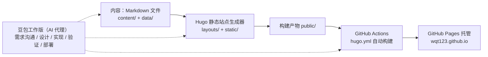

# 用豆包工作版 + Hugo + GitHub 搭建个人博客

## 一、为什么搭这个博客

个人博客这件事，我想要的不是"一个能发文章的网站"，而是：

- **免费**：不买服务器、不续费域名，长期维护成本为零
- **可控**：内容就是 Markdown 文件，放自己仓库里，随时迁移
- **长积累**：把零散输入沉淀成可复用的理解，而不是发完就散
- **有设计感**：不是套一个现成主题模板，而是能自己迭代出想要的样子

这条路线最成熟的组合就是 **Hugo（静态站点生成）+ GitHub Pages（托管）+ GitHub Actions（自动部署）**。而"设计感和可控性"这部分，由豆包工作版作为 AI 代理来辅助完成——从需求沟通、设计迭代、模板实现到部署验证，全程协作。

## 二、整体架构与分工



- **Hugo**：负责把 Markdown 变成 HTML。特点是快、单二进制、模板体系灵活，适合内容优先的个人站
- **GitHub Pages**：免费静态托管，绑定了 `wqt123.github.io` 这个免费域名
- **GitHub Actions**：推送到 `main` 分支后自动构建并发布，全程不用手动上传
- **豆包工作版**：在本地仓库里直接协作——读项目、写模板、迭代设计、执行命令、提交推送，相当于一个能动手的工程助手

## 三、关键步骤

### 1. 初始化站点与仓库

```bash
hugo new site wqt123.github.io
git init
git remote add origin git@github.com:wqt123/wqt123.github.io.git
```

本地用与 CI 一致的版本（本项目固定 `Hugo 0.145.0 extended`），避免"本地能构建、线上报错"的版本差异问题。

### 2. 配置 GitHub Pages 自动部署

在仓库里放一个 workflow 文件 `.github/workflows/hugo.yml`，核心思路：

```yaml
on:
  push:
    branches: [main]

jobs:
  build:
    runs-on: ubuntu-latest
    steps:
      - uses: actions/checkout@v4
      - uses: actions/configure-pages@v5
      - uses: peaceiris/actions-hugo@v3
        with:
          hugo-version: "0.145.0"
          extended: true
      - run: hugo --minify
      - uses: actions/upload-pages-artifact@v3
        with:
          path: ./public

  deploy:
    needs: build
    runs-on: ubuntu-latest
    steps:
      - uses: actions/deploy-pages@v4
```

然后在 GitHub 仓库的 Settings → Pages 里，把发布源选成 **GitHub Actions**。之后每次 `git push`，线上自动更新。

### 3. 用 AI 迭代视觉设计

这是最有意思的部分。我没有直接套主题，而是把设计需求拆给豆包工作版：

1. 先让它熟悉现有站点，读结构、读样式，理解"现在长什么样"
2. 给出几个明确的设计方向（高保真 HTML 示例），每个都包含首页、文章列表、文章阅读页三个视图，直接在浏览器里对比
3. 一轮轮提意见：去掉当前关注区块、去掉区块标题、导航只留 GitHub……每次修改后 AI 自动截图自检布局和溢出
4. 定稿后，把定稿方向翻译成 Hugo 模板与 CSS tokens

最终的方向是"信号白 · 编辑实验室"：真白背景、靛蓝主色、琥珀信号点、零圆角、编辑刊物式排版。设计原则是**克制**——首页只有主标语和四类内容入口，不放文章流、不做卡片堆砌。

### 4. 建立内容模型

为了让内容有结构而不是一锅粥，定义了四个主分类，每篇文章必须且只能属于一个：

| 分类 | 定位 |
| --- | --- |
| 学习笔记 | 概念拆解、论文阅读、工具探索 |
| 项目实践 | 真实实现、踩坑记录、工程复盘 |
| 深度专题 | 系统整理后可长期复用的内容 |
| 随想 | 行业观察、个人判断、未完成想法 |

技术主题用 tags 表达，主分类与标签各司其职。分类数据放在 `data/categories.toml` 作为单一事实来源，Hugo 构建时用模板校验每篇文章的分类是否合法，缺分类直接构建失败——把内容规范变成工程约束。

### 5. 评论与浏览量

文章页做了两个轻量集成，都遵循"**第三方失败不影响阅读**"的原则：

- **浏览量**：GoatCounter，免费、隐私友好，只在文章页加载计数
- **评论**：Giscus，评论数据存在仓库的 GitHub Discussions 里，评论者用 GitHub 账号登录

两个集成都通过 `hugo.toml` 参数控制开关，未配置时显示稳定的占位状态（`— 次阅读`、"评论区尚未启用"），拿到外部配置后开启即可，不需要改模板。

## 四、AI 代理在这里做了什么

如果只用一个词概括豆包工作版在这条流水线里的角色，是**执行者**：

- 读代码、读文档，不靠猜
- 每个设计决策先给方案再动手，重要变更先说清楚影响
- 写完模板跑构建，构建完截图核对，不只停留在"文件写出来了"
- 部署后验证线上 URL 真实可访问，而不是默认成功

和纯模板站相比，这样得到的不是一个"能用"的站点，而是一个**按自己意图长出来**的站点。

## 五、踩坑与经验

1. **Hugo 版本要对齐**：本地和 CI 用同一个版本（extended），否则模板语法差异会在线上炸
2. **GitHub Pages 部署源要选 Actions**：选"从分支部署"会忽略 workflow 产物，改成 Actions 后才走自动构建
3. **AI 生成内容要验证**：AI 写的模板同样可能有不匹配的变量、过期的 API，本地构建 + 渲染结果核对是底线
4. **第三方集成的降级设计**：统计和评论都做成"未启用即稳定占位"，保证功能没配好时页面依然干净完整
5. **内容规范转工程约束**：分类合法性在构建期校验，比"靠人自觉"可靠得多

## 六、成本与总结

- **钱**：0 元。Hugo 免费、GitHub Pages 免费、GoatCounter 免费
- **维护**：写文章就是加一个 Markdown 文件，推上去自动上线
- **控制权**：所有代码、内容、样式都在自己仓库里

这套组合适合所有想长期、低成本、可控地维护个人内容的人。AI 代理的价值不在"生成一个网站"，而在把"我想象中的网站"一步步变成"实际运行的网站"——设计有人讨论，代码有人实现，问题有人排查，部署有人验证。

> 真正代表你会搭博客的，不是"能跑起来"，而是"以后每一篇文章，都能稳定地、按你想要的方式发布"。
