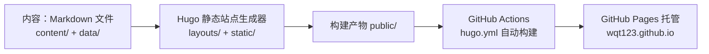

# 用 Hugo 搭建个人博客：从设计到自动部署

## 一、为什么搭这个博客

个人博客这件事，我想要的不是"一个能发文章的网站"，而是：

- **免费**：不买服务器、不续费域名，长期维护成本为零
- **可控**：内容就是 Markdown 文件，放自己仓库里，随时迁移
- **长积累**：把零散输入沉淀成可复用的理解，而不是发完就散
- **有设计感**：不是套一个现成主题模板，而是能自己迭代出想要的样子

在静态站点生成器里，我对比过 Jekyll、Hexo、Hugo 三者，最终选 Hugo 的理由很具体：

- **单二进制**：整个工具就是一个可执行文件，macOS 上放到 `~/bin` 就能用，不依赖 Ruby / Node 运行时
- **构建快**：几十篇文章的站点构建在几十毫秒内完成，本地预览即时刷新
- **模板体系强**：`baseof` 继承、`partials` 复用、taxonomy 原生成，足够表达自定义设计，不需要去改主题源码
- **数据驱动**：`data/` 目录 + 模板遍历，可以把"分类定义"这类元数据做成单一事实来源

## 二、站点架构

### 整体架构



- **Hugo**：负责把 Markdown 变成 HTML。快、单二进制、模板体系灵活
- **GitHub Pages**：免费静态托管，绑定 `wqt123.github.io` 免费域名
- **GitHub Actions**：推送 `main` 分支后自动构建并发布，全程不用手动上传
- **AI 代理（豆包工作版）**：在本地仓库里直接协作——读项目、写模板、迭代设计、执行命令、提交推送

### 目录结构

一个 Hugo 站点的核心目录只有几个：

```text
wqt123.github.io/
├── hugo.toml            # 全局配置
├── content/             # 内容（Markdown）
│   ├── _index.md        # 首页内容
│   ├── posts/           # 文章 section
│   │   ├── _index.md    # 文章列表页内容
│   │   └── 2026-xx-xx-xxx.md
│   └── categories/      # 分类 taxonomy 的 term 内容
│       ├── notes/_index.md
│       ├── projects/_index.md
│       ├── topics/_index.md
│       └── thoughts/_index.md
├── layouts/             # 模板
│   ├── _default/
│   │   ├── baseof.html  # 全站骨架
│   │   ├── index.html   # 首页
│   │   ├── list.html    # 列表页
│   │   └── single.html  # 文章页
│   ├── partials/        # 可复用片段
│   └── taxonomy/        # 分类页模板
├── data/                # 非内容型数据（分类定义）
├── static/              # 原样发布的静态资源（CSS/JS）
├── archetypes/          # 新文章模板
└── .github/workflows/   # CI 部署
```

关键认知：**content/ 放内容，layouts/ 放结构，data/ 放元数据，static/ 放资源**。这四者解耦，是 Hugo 模板体系好用的前提。

## 三、内容与配置

### 配置：hugo.toml

本博客的核心配置（节选）：

```toml
baseURL = "https://wqt123.github.io/"
languageCode = "zh-cn"
title = "WQT Agent Lab"
hasCJKLanguage = true
enableRobotsTXT = true

[params]
description = "一个 Agent 工程师持续学习、构建和思考的个人工作台。"
subtitle = "和智能体一起，持续构建。"

[taxonomies]
tag = "tags"
series = "series"
category = "categories"

[permalinks]
posts = "/posts/:slug/"
```

几个值得注意的点：

- `hasCJKLanguage = true`：让 Hugo 按 CJK 语言规则做摘要截断，否则中文摘要的截断位置会奇怪
- `taxonomies`：内置 tag/series，新增 category，三个分类体系各司其职
- `permalinks`：文章 URL 用 `:slug`，不暴露日期，方便长期稳定引用
- `summaryLength`：控制在列表页截断正文的长度

### 内容组织：section 与 taxonomy

个人博客最容易失控的地方是"内容没有结构"。我用两层模型解决：

**主分类（taxonomy，必选其一）**——表达"这篇内容是什么性质"：

| 分类 | 定位 |
| --- | --- |
| notes 学习笔记 | 概念拆解、论文阅读、工具探索 |
| projects 项目实践 | 真实实现、踩坑记录、工程复盘 |
| topics 深度专题 | 系统整理后可长期复用的内容 |
| thoughts 随想 | 行业观察、个人判断、未完成想法 |

**标签（tag，可选多个）**——表达"这篇内容涉及什么技术"。

分类定义放在 `data/categories.toml`，成为单一事实来源：

```toml
[[categories]]
slug = "projects"
title = "项目实践"
code = "BUILD"
description = "真实实现、踩坑记录、工程复盘。"
empty = "正在构建"
```

每篇文章在 front matter 里声明归属：

```yaml
---
title: "用 Hugo 搭建个人博客"
date: 2026-09-27T11:00:00+08:00
categories:
  - projects
tags: ["hugo", "github-pages"]
---
```

**把内容规范变成工程约束**：模板里有一个 partial 专门校验分类合法性，文章没有分类或分类不在定义表里，构建直接失败。靠构建期报错，而不是靠人自觉。

## 四、模板与设计

### 先理解：页面是怎么被渲染的

Hugo 把"内容"和"长相"彻底分开：`content/` 里的 Markdown 只负责内容，`layouts/` 里的模板决定每个页面长什么样。渲染时按**页面类型**匹配模板：

```
文章页   content/posts/xxx.md ──→ layouts/_default/single.html
首页                       ──→ layouts/index.html
分类列表页                 ──→ layouts/_default/list.html
```

三种页面都嵌在同一个 baseof 骨架里，导航、页脚共用。于是：**想改长相，改模板；想加内容，写 Markdown——两边互不打扰**。这也是后面所有设计决策的出发点。

### baseof：全站只写一次的部分

baseof 是全站骨架：`<html>`、头部 meta、导航、页脚都在这里，任何页面都继承它。核心只有一行 `{{ block "main" . }}`——这是一个**插槽**，具体页面（首页、文章页）只负责填这一块：

```go-html-template
<body>
  <header class="site-header">…导航…</header>
  <main id="main-content" class="site-main">
    {{ block "main" . }}{{ end }}   <!-- 页面内容插在这里 -->
  </main>
  <footer class="site-footer">…页脚…</footer>
</body>
```

效果：全站一致的部分只写一次，改一次导航，所有页面跟着变。

### 首页：结构由数据驱动

首页不放死文章列表，而是读 `data/categories.toml` 里的分类数据，循环渲染入口卡片：

```go-html-template
{{ range $index, $category := .Site.Data.categories.categories }}
  <a class="category-path" href="{{ $.Site.GetPage (printf "/categories/%s" $category.slug) }}">
    <span>{{ printf "%02d" (add $index 1) }} / {{ $category.code }}</span>
    <h3>{{ $category.title }}</h3>
  </a>
{{ end }}
```

效果：首页结构由数据决定。以后加一个新分类，改一行数据即可，模板一行不用动——这就是前面说的"内容与结构解耦"落到实处的样子。

### 文章页：元信息、目录、正文的组装

文章页按固定顺序组装：头部（分类、日期、阅读时长）→ 侧栏目录 → 正文。最值得注意的一行是目录的**条件显示**：

```go-html-template
{{ if gt (len .TableOfContents) 40 }}
  <aside class="article-toc">{{ .TableOfContents }}</aside>
{{ end }}
<div class="article-content">{{ .Content }}</div>
```

`.TableOfContents` 是 Hugo 原生生成的目录 HTML，模板只判断"目录够长才显示侧栏"。于是**长文自动有目录，短文不浪费版面**——功能是 Hugo 给的，设计取舍是自己的。

### 用 AI 迭代视觉设计

模板决定了"怎么实现"，这一节讲"为什么长这样"。我没有直接套主题，而是把设计需求拆给豆包工作版（AI 代理）：

1. 先让它熟悉现有站点：读结构、读样式，理解"现在长什么样"
2. 给出几个明确的设计方向（高保真 HTML 示例），每个都包含首页、文章列表、文章阅读页三个视图，直接在浏览器里对比
3. 一轮轮提意见：去掉"当前关注"区块、去掉区块标题、导航只留 GitHub……每次修改后 AI 自动截图自检布局和溢出
4. 定稿后，把定稿方向翻译成 Hugo 模板与 CSS tokens

最终的方向是"信号白 · 编辑实验室"：真白背景、靛蓝主色、琥珀信号点、零圆角、编辑刊物式排版。设计原则是**克制**——首页只有主标语和四类内容入口，不放文章流、不做卡片堆砌。AI 的价值不在"生成一个网站"，而在把"我想象中的网站"一步步变成"实际运行的网站"。

## 五、构建与发布

### 本地构建与预览

安装（与 CI 完全一致的版本）：

```bash
mkdir -p ~/bin
curl -L -o /tmp/hugo.tar.gz \
  https://github.com/gohugoio/hugo/releases/download/v0.145.0/hugo_extended_0.145.0_darwin-universal.tar.gz
tar -xzf /tmp/hugo.tar.gz -C /tmp
mv /tmp/hugo ~/bin/hugo
hugo version   # v0.145.0+extended
```

预览与构建：

```bash
hugo server          # 本地实时预览，默认 http://localhost:1313
HUGO_ENVIRONMENT=production hugo --minify   # 生产构建，产物在 public/
```

**版本对齐原则**：本地版本必须和 CI 工作流里 `hugo-version` 完全一致，否则模板语法差异会在线上炸。`extended` 版本必须开，否则 SCSS/SASS 相关的模板无法编译。

### 自动部署：GitHub Pages + Actions

部署的核心是 `.github/workflows/hugo.yml`：

```yaml
on:
  push:
    branches: [main]

permissions:
  contents: read
  pages: write
  id-token: write

concurrency:
  group: pages
  cancel-in-progress: true

jobs:
  build:
    runs-on: ubuntu-latest
    steps:
      - uses: actions/checkout@v4
      - uses: actions/configure-pages@v5
      - uses: peaceiris/actions-hugo@v3
        with:
          hugo-version: "0.145.0"
          extended: true
      - run: hugo --minify
      - uses: actions/upload-pages-artifact@v3
        with:
          path: ./public

  deploy:
    needs: build
    runs-on: ubuntu-latest
    steps:
      - uses: actions/deploy-pages@v4
```

配套的**一次性设置**（在 GitHub 仓库 Settings → Pages）：

1. Build and deployment → Source 选择 **GitHub Actions**（不是"从分支部署"！）
2. 之后每次 `git push main`，自动完成 构建 → 上传产物 → 发布

## 六、统计与评论

博客上线后，我补上了两件"内容网站标配"：浏览量统计和读者评论。两条路线都遵循同一个维护哲学——**免费、数据可控、不依赖自建后端**。

### 浏览量：GoatCounter

选型时对比过 Umami、Plausible、不蒜子，最后选 GoatCounter：

- **免费额度 10 万 PV/月**，对个人博客足够
- **隐私友好**：无 Cookie、不按个人身份跟踪
- 数据可导出，也支持自托管（同样是一个单二进制）

接入分三层：**上报**（页面里的 `count.js` 把访问发给 GoatCounter）、**后台**（看 PV/UV、来源、页面排行）、**展示**（文章页 meta 区显示阅读数）。

有两个设置必须在 GoatCounter 后台手动打开，否则计数接口会直接 403：

- **Dashboard viewable by → Anyone**（公开统计）：访客计数功能只对公开站点开放
- **Allow adding visitor counts on your website**（允许计数显示）：默认关闭

展示端我没有用官方徽章 iframe（自带边框和 "by GoatCounter" 字样，和"信号白"的克制排版不搭），而是请求官方 **JSON 端点**，把数字渲染成纯文本：

```js
fetch('https://MYCODE.goatcounter.com/counter/' + encodeURIComponent(path) + '.json')
  .then(r => r.json())
  .then(d => { el.textContent = d.count; })
```

`MYCODE` 是你注册时选择的账号名（形如 `你的账号.goatcounter.com`），属于账号级标识，示例用占位符代替。

两个实践细节：

- **计数显示有最长 4 小时缓存**：新页面、首次访问的数字不会立刻出现，属正常现象
- **脚本自托管**：官方 CDN（`gc.zgo.at`）在国内网络不可达，把 `count.js` 下载到 `static/js/` 本地托管；静态 JS 用 Hugo fingerprint 加哈希，避免浏览器缓存旧版本

### 评论：Giscus

评论对比过 utterances、Twikoo、Waline，最终选 **Giscus**：评论数据直接存在**你仓库的 GitHub Discussions** 里，没有数据库、没有后端、永久免费，访客用 GitHub 账号即可评论，你还能在 GitHub 上直接管理全部评论。

接入步骤：

1. 仓库 Settings → Features 启用 **Discussions**，分类选 **Announcements**（只有维护者能开帖，评论不会被刷屏）
2. 安装 **giscus GitHub App**（授权时只勾选博客仓库，最小权限）
3. 在 giscus.app 配置页选择仓库与分类后，页面会自动生成 `data-repo-id` 和 `data-category-id`——这两个是账号级标识，不写进公开内容。配置长这样：

```toml
[params.giscus]
enabled = true
repo = "你的用户名/你的博客仓库"
repoId = "在 giscus.app 自动生成"
category = "Announcements"
categoryId = "在 giscus.app 自动生成"
```

4. 文章页挂 giscus 的 `client.js`，配置 `data-mapping="pathname"`——按页面路径自动匹配对应讨论

我选 `pathname` 映射：**每篇文章自动对应一个 Discussion**，访客评论即落到该文章标题下，不需要手动创建。
